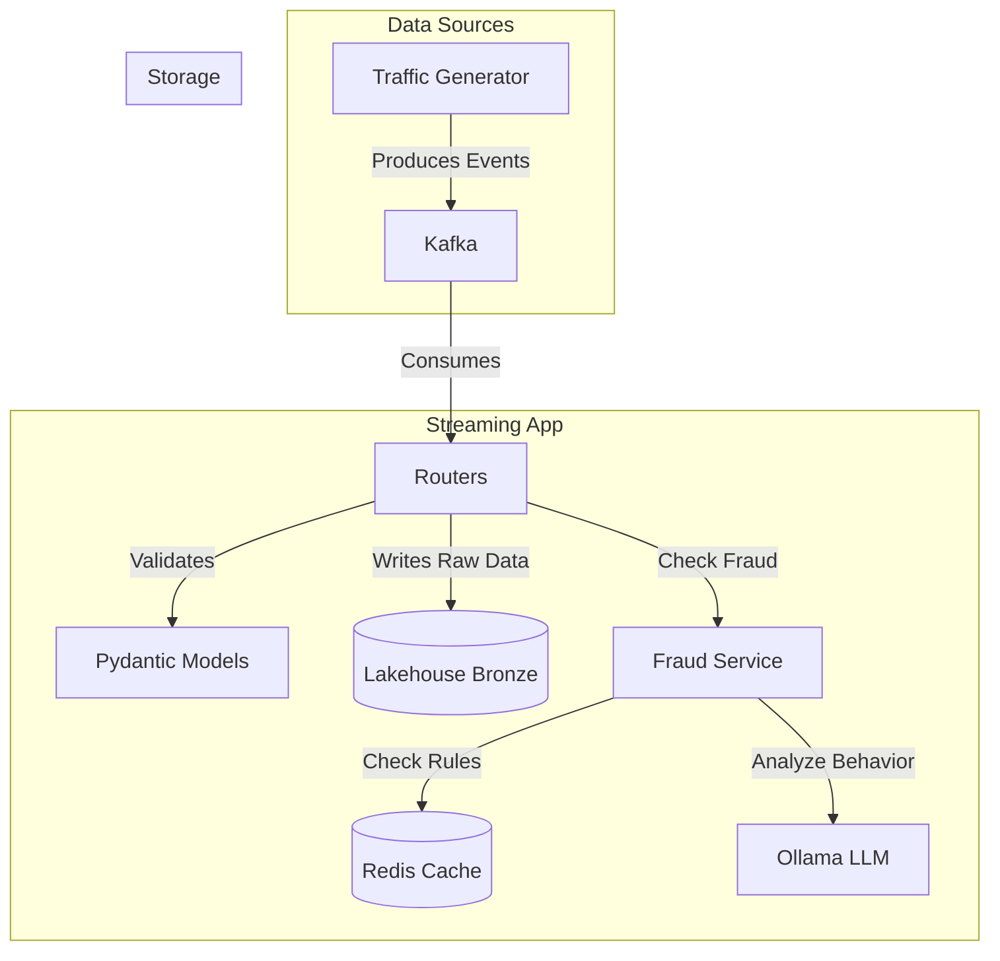
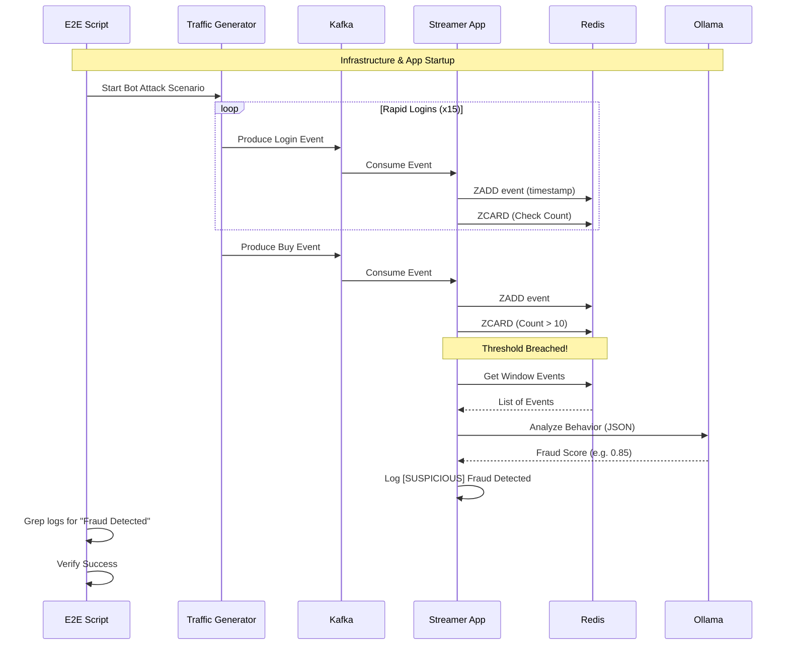

# Welcome to FastAPI kafka stream processor (fkl-streamer)

This application:
- uses FastAPI as base framework to create a data service
- consumes data from Kafka server topics
- source it to Delta Lake lakehouse for ML downstream tasks

## Architecture



## E2E Test Flow

Sequence of events during the `e2e_test.sh` bot attack scenario:



## Run the app in local for event production/consumption

### Requirements
Python virtual environment can be setup as follows:

1. Install [uv](https://docs.astral.sh/uv/getting-started/installation/)
2. Install just https://github.com/casey/just to use commands in the justfile.
4. run
```
$ just install
```

### Run Kafka server
Run the Kafka server locally with
```
$ just kafka-server
```
from project root folder.

### add Kafka topics
```
$ just kafka-add-topics
```

### run the consumer app locally
```
$ just run-locally
```

### produce events in Kafka topics
For media radio events:
```
$ just kafka-produce-media-radio
```

For media tv events:
```
$ just kafka-produce-media-tv
```

For sales events:
```
$ just kafka-produce-sales
```

## Testing

To run the test suite with coverage reporting:

```bash
# Run tests and generate coverage report
uv run pytest --cov=src --cov-report=term-missing
```

Note: If running locally without Kafka/SASL credentials, you may need to bypass auth checks:
```bash
KAFKA_SASL_AUTH_ENABLED=False uv run pytest --cov=src --cov-report=term-missing
```

## Lakehouse

We will implement a medallion architecture.

### Bronze
Will receive consumed data from Kafka in raw event form.

### Silver
Will join consumed data from Kafka raw events in bronze stage to aggregate in silver stage.

### Gold
Will model data for feature store and ML downstream tasks.

## Local deployment

Use docker-compose or K8s locally:
```
$ just run-docker-compose
```
if you want to lanch both kafka and the app, or
```
$ just k8s-apply
----
deployment.apps/fkl-streamer-app created
service/fkl-streamer-app-service created

```

for local app K8s deployment.
Don't forget to clean up deployments and services afterwords! :)
